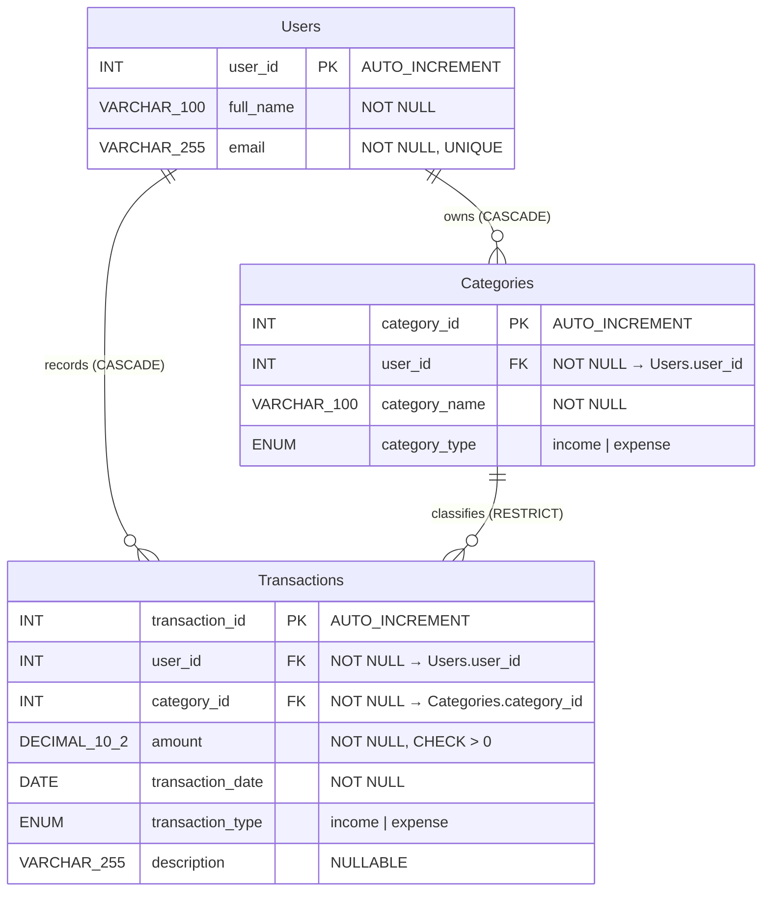
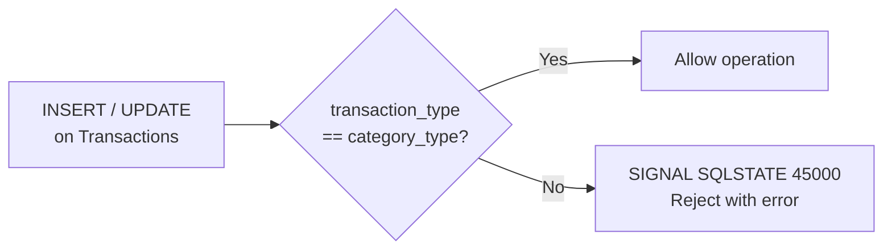
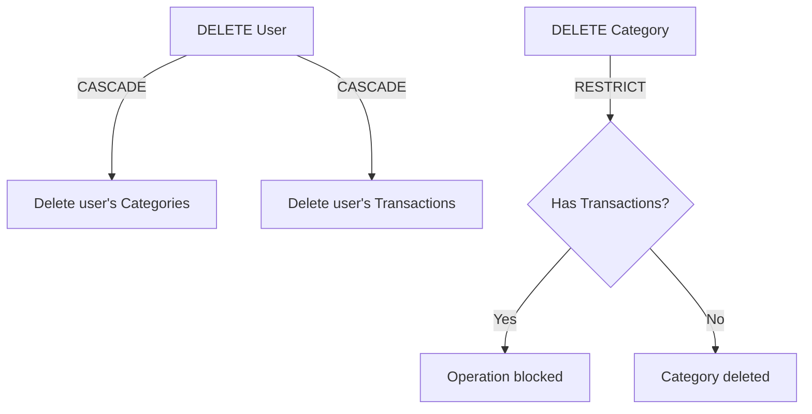

# Enhanced Entity-Relationship (EER) Diagram

This EER diagram extends the basic ER by showing data types, constraints,
triggers, and deletion behavior.

## Constraints Detail

| Table | Constraint | Type | Rule |
|---|---|---|---|
| Users | `uq_users_email` | UNIQUE | `email` must be unique |
| Categories | `fk_categories_user` | FOREIGN KEY | `user_id → Users(user_id)` ON DELETE CASCADE |
| Categories | `chk_category_type` | CHECK | `category_type IN ('income', 'expense')` |
| Transactions | `fk_transactions_user` | FOREIGN KEY | `user_id → Users(user_id)` ON DELETE CASCADE |
| Transactions | `fk_transactions_category` | FOREIGN KEY | `category_id → Categories(category_id)` ON DELETE RESTRICT |
| Transactions | `chk_amount_positive` | CHECK | `amount > 0` |
| Transactions | `chk_transaction_type` | CHECK | `transaction_type IN ('income', 'expense')` |

## Triggers (Cross-Table Validation)

| Trigger | Event | Rule |
|---|---|---|
| `trg_check_type_match_insert` | BEFORE INSERT | `Transactions.transaction_type` must equal `Categories.category_type` |
| `trg_check_type_match_update` | BEFORE UPDATE | Same check on update |

## Deletion Behavior

