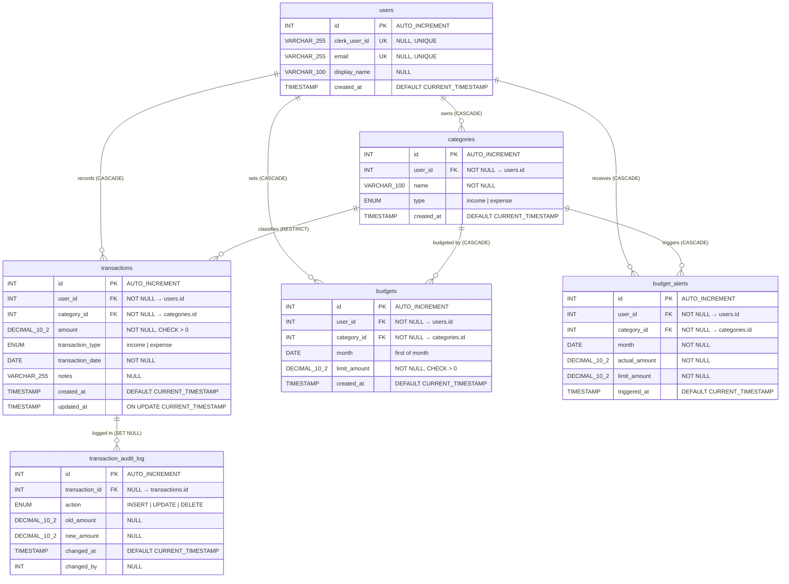
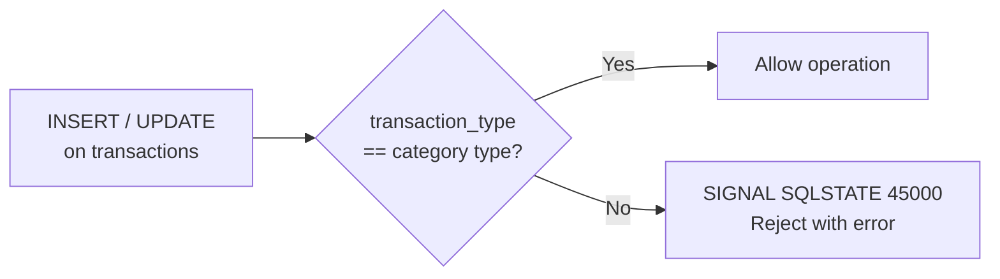
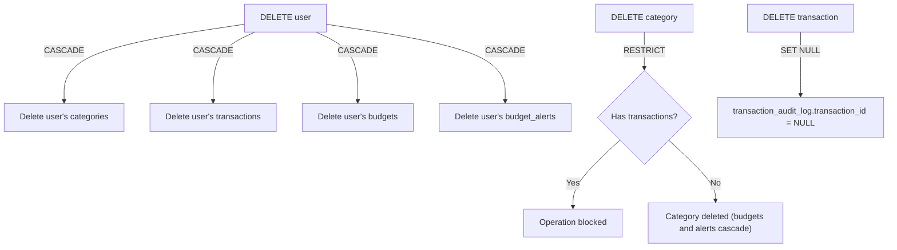

# Enhanced Entity-Relationship (EER) Diagram

The EER diagram extends the ER view with data types, constraints, deletion behavior,
triggers, and the security-definer views the application reads from.

## Constraints Detail

| Table | Constraint | Type | Rule |
|---|---|---|---|
| users | `uq_users_clerk_user_id` | UNIQUE | `clerk_user_id` unique when not NULL |
| users | `uq_users_email` | UNIQUE | `email` unique when not NULL |
| categories | `fk_categories_user` | FOREIGN KEY | `user_id → users(id)` ON DELETE CASCADE |
| categories | `uq_categories_user_name` | UNIQUE | `(user_id, name)` |
| categories | `chk_category_type` | CHECK | `type IN ('income', 'expense')` |
| transactions | `fk_transactions_user` | FOREIGN KEY | `user_id → users(id)` ON DELETE CASCADE |
| transactions | `fk_transactions_category` | FOREIGN KEY | `category_id → categories(id)` ON DELETE RESTRICT |
| transactions | `chk_amount_positive` | CHECK | `amount > 0` |
| transactions | `chk_transaction_type` | CHECK | `transaction_type IN ('income', 'expense')` |
| budgets | `fk_budgets_user` | FOREIGN KEY | `user_id → users(id)` ON DELETE CASCADE |
| budgets | `fk_budgets_category` | FOREIGN KEY | `category_id → categories(id)` ON DELETE CASCADE |
| budgets | `chk_budgets_limit` | CHECK | `limit_amount > 0` |
| budgets | `uq_budgets_user_cat_month` | UNIQUE | `(user_id, category_id, month)` |
| budget_alerts | `fk_budget_alerts_user` | FOREIGN KEY | `user_id → users(id)` ON DELETE CASCADE |
| budget_alerts | `fk_budget_alerts_category` | FOREIGN KEY | `category_id → categories(id)` ON DELETE CASCADE |
| budget_alerts | `uq_budget_alerts_user_cat_month` | UNIQUE | `(user_id, category_id, month)` |
| transaction_audit_log | `fk_audit_log_transaction` | FOREIGN KEY | `transaction_id → transactions(id)` ON DELETE SET NULL |

## Triggers (Cross-Table Validation and Audit)

| Trigger | Event | Rule |
|---|---|---|
| `trg_check_type_match_insert` | BEFORE INSERT | `transactions.transaction_type` must equal the parent `categories.type` |
| `trg_check_type_match_update` | BEFORE UPDATE | Same check on the post-update row |
| `trg_log_tx_changes_insert` | AFTER INSERT | Writes an `INSERT` row to `transaction_audit_log` |
| `trg_log_tx_changes_update` | AFTER UPDATE | Writes an `UPDATE` row capturing old and new amounts |
| `trg_log_tx_changes_delete` | BEFORE DELETE | Writes a `DELETE` row before the parent disappears, so the FK can be SET NULL safely |

## Deletion Behavior

## Security-Definer Views

The application accesses all data through security-definer views rather than base tables
directly. The application database user (`app_user`) has no direct table privileges; all
SELECT, INSERT, UPDATE, and DELETE operations go through these views, which filter rows
to the authenticated user via a session variable set on each connection.

| View | SQL SECURITY | Filters By | Purpose |
|------|--------------|-----------|---------|
| `v_user_transactions` | DEFINER (root) | `@current_user_id = users.id` | Transactions for the authenticated user |
| `v_user_categories`   | DEFINER (root) | `@current_user_id = users.id` | Categories for the authenticated user |
| `v_user_budgets`      | DEFINER (root) | `@current_user_id = users.id` | Budgets joined with category and actual spend |
| `v_transaction_detail`| DEFINER (root) | `@current_user_id = users.id` | Transactions joined with category and user, used by reports |

The `@current_user_id` value is read by `current_app_user_id()`, a SECURITY DEFINER
helper function that wraps the session variable. This indirection is required because
MySQL views cannot reference user-defined session variables directly (ERROR 1351).
