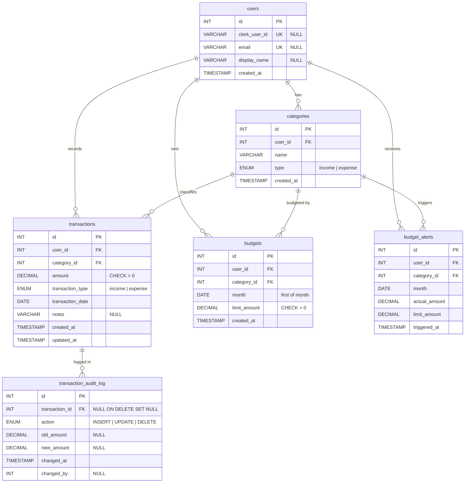

# Entity-Relationship (ER) Diagram

## Relationships

| Relationship | Cardinality | Description |
|---|---|---|
| users → categories | One-to-Many | A user owns many categories |
| users → transactions | One-to-Many | A user records many transactions |
| users → budgets | One-to-Many | A user sets many budgets |
| users → budget_alerts | One-to-Many | A user receives many budget alerts |
| categories → transactions | One-to-Many | A category classifies many transactions |
| categories → budgets | One-to-Many | A category can have one budget per month per user |
| categories → budget_alerts | One-to-Many | A category can trigger many alerts |
| transactions → transaction_audit_log | One-to-Many | A transaction has many audit log entries |
