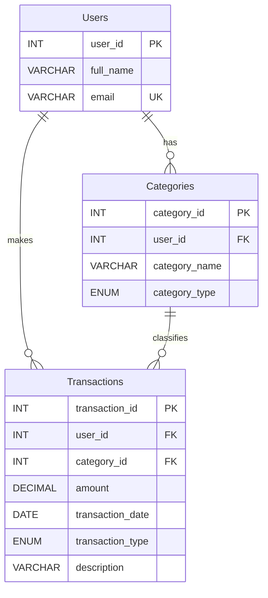

# Entity-Relationship (ER) Diagram

## Relationships

| Relationship | Cardinality | Description |
|---|---|---|
| Users > Categories | One-to-Many | A user defines many categories |
| Users > Transactions | One-to-Many | A user creates many transactions |
| Categories > Transactions | One-to-Many | A category classifies many transactions |
